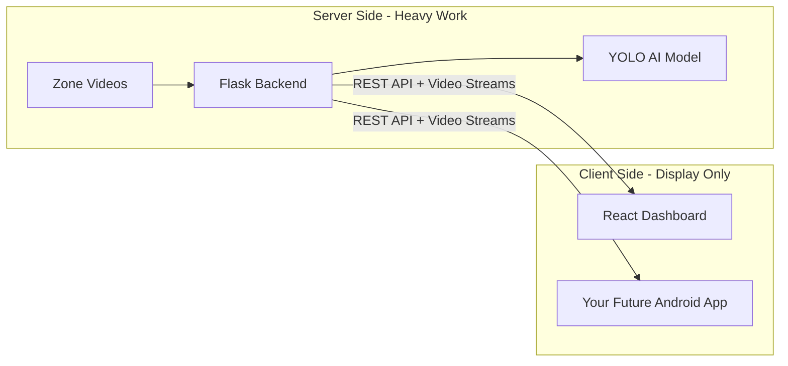
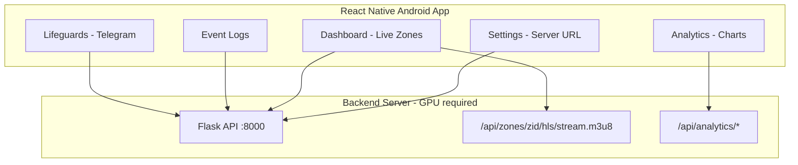
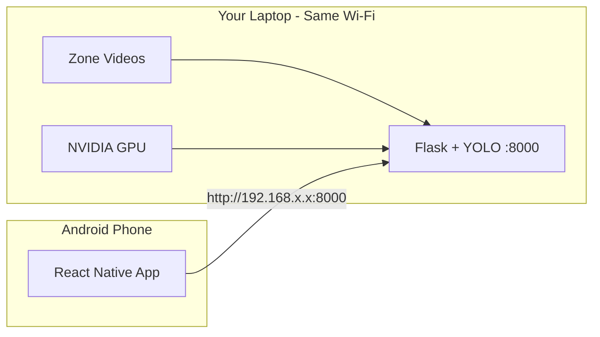
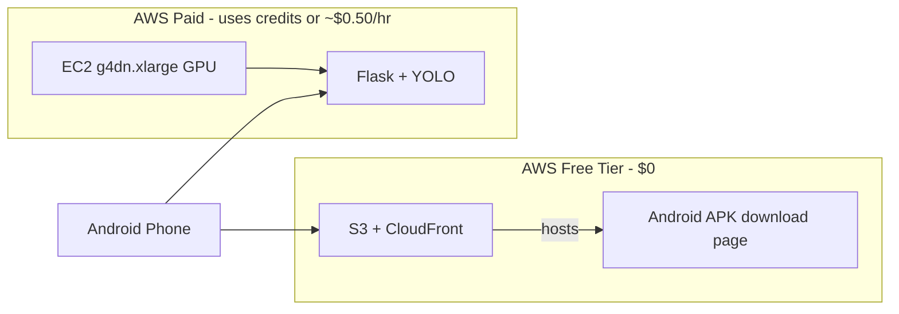

# CoastVision: Performance Improvements + Android App + Cloud Deployment

## Part 1 — What This Project Actually Is (Simple Overview)

CoastVision is a **two-part system**:




| Part         | Technology                 | Job                                                                       |
| ------------ | -------------------------- | ------------------------------------------------------------------------- |
| **Backend**  | Python + Flask + YOLO      | Reads beach/pool videos, runs AI detection, creates alerts, streams video |
| **Frontend** | React + Vite + Material UI | Shows live zones, charts, alerts, Telegram settings                       |


**Important for your Android plan:** The AI (YOLO) should stay on a **server with a GPU** (your laptop, college PC, or cloud). Your Android app will **display the full Dashboard, Analytics, alerts, and lifeguard tools** — it does not run AI on the phone. This is the correct approach for a 3rd-year project.

**Current model performance (documented):** ~86.5% mAP50 overall, ~90.5% on "Drowning" class. Inference ~20ms per image on RTX 3050.

**What the repo does NOT include (you must add yourself):**

- `models/best.pt` (trained weights — download/train separately)
- `dataset/` (Roboflow dataset — not in git)
- Docker files (deployment is manual today)

---

## Part 2 — Performance Improvements

Performance bottlenecks are ranked by impact. Start from the top.

### 2A. Backend AI Performance (Highest Impact)

**Problem 1: GPU lock blocks all zones**

In `[backend/server.py](backend/server.py)`, all zone threads share one lock (`_INFER_LOCK`). If you monitor 4 zones, they wait in line for the GPU — like one cashier serving four queues.

**Fix options (pick based on your GPU):**

- **Quick win:** Increase `COASTVISION_INFER_EVERY=3` or `4` (run AI every 3rd/4th frame instead of every 2nd)
- **Quick win:** Lower `COASTVISION_MAX_SIDE=640` or `720` (smaller frames = faster inference)
- **Quick win:** Set `COASTVISION_ENABLE_PERSON_DET=0` if your `best.pt` already has a "person" class (avoids running two YOLO models)
- **Medium effort:** Batch frames from multiple zones into one `predict()` call (requires code change in `_zone_worker`)
- **Advanced:** Use TensorRT or ONNX export for 2–3× faster inference

**Problem 2: Double model inference**

Backend may load both `best.pt` (drowning) and `yolov8n.pt` (person). Two models = double GPU time.

**Fix:** Train or use a single model with all needed classes, then disable person model.

**Problem 3: Blocking Telegram alerts**

`[backend/telegram_notify.py](backend/telegram_notify.py)` uses synchronous `requests.post` during detection. Slow Telegram API can delay the detection loop.

**Fix:** Move Telegram sends to a background thread/queue (simple `queue.Queue` + worker thread).

**Recommended env settings for cloud GPU (add to server startup):**

```powershell
COASTVISION_DEVICE=cuda:0
COASTVISION_HALF=1
COASTVISION_MAX_SIDE=960
COASTVISION_IMGSZ=640
COASTVISION_FPS=12
COASTVISION_INFER_EVERY=2
COASTVISION_DET_HOLD_S=0.9
COASTVISION_HLS_ENABLED=1
```

Tune with `GET /api/health` — it returns current performance settings.

### 2B. Streaming Performance


| Setting                       | Purpose                                            | Mobile/Cloud tip         |
| ----------------------------- | -------------------------------------------------- | ------------------------ |
| `COASTVISION_HLS_BITRATE=1M`  | Lower bandwidth for phone users                    | Use 1M on cloud, not 2M  |
| `COASTVISION_HLS_SEGMENT_S=2` | Shorter segments = lower latency but more requests | Use 2s for lifeguard app |
| `COASTVISION_GRID_MAX_W=480`  | Smaller thumbnails in grid view                    | Helps mobile data        |


HLS is already ~10× more efficient than MJPEG — keep HLS as primary for Android.

### 2C. Frontend / Mobile Client Performance

Current `[frontend/web/src/App.jsx](frontend/web/src/App.jsx)` is ~4,000 lines and polls the API very aggressively (every 700ms–2s across many endpoints).

**Improvements for full Android app (Dashboard + Analytics):**

- Poll only when app is visible (`AppState` in React Native — pause polling when app is in background)
- Use **lazy loading** — load Analytics charts only when user opens that tab (saves battery)
- Prefer HLS on mobile; use frame polling only as fallback on weak networks
- Replace aggressive 700ms detection polling with 1–2s on mobile (still smooth enough)
- Use SSE (`GET /api/lifeguards/{lg_id}/stream`) for real-time alerts instead of polling every 1s
- Add a **mobile bottom navigation bar** (5 tabs) instead of cramming 6 desktop tabs in the header
- Cache last-known API responses so Analytics screens show data instantly while refreshing in background

**APIs needed for full app (all already exist in backend):**

| Feature | Endpoints |
|---------|-----------|
| Dashboard | `/api/zones`, `/api/zones/{id}/hls/stream.m3u8`, `/api/zones/{id}/detections`, `/api/health` |
| Analytics | `/api/analysis`, `/api/analytics/timeline`, `/api/analytics/crowd-status`, `/api/analytics/response-times`, `/api/zones/{id}/timeline` |
| Event Logs | `/api/alerts?limit=120` |
| Lifeguards | `/api/lifeguards/*`, `/api/telegram/*` |
| Settings | `/api/health`, crowd thresholds |

### 2D. Model Accuracy Improvements (Longer Term)

From project docs (`[scripts/evaluation_results.md](scripts/evaluation_results.md)`):


| Improvement                                           | Expected gain              | Effort                              |
| ----------------------------------------------------- | -------------------------- | ----------------------------------- |
| More training data (Roboflow + your own beach videos) | +15–25% generalization     | Medium                              |
| Balance underrepresented classes                      | Fewer false alarms         | Medium                              |
| Upgrade to YOLOv11n                                   | +15–20% mAP                | Medium (docs exist, script missing) |
| Multi-frame drowning logic (track person 5–10 frames) | Better real-world accuracy | High (good final-year upgrade)      |


---

## Part 3 — Android App Plan (React Native — Full Dashboard + Analytics)

**Your chosen approach:** Build a **React Native** app with all 5 tabs, connected to your **laptop backend over Wi-Fi** ($0).

### 3A. What the Android App Should Include

**All 5 main sections (matching the web dashboard):**

| Tab | What it shows | Mobile adaptation |
|-----|---------------|-------------------|
| **Dashboard** | Live zone grid, zone modal with HLS video + detection boxes | 1-column zone cards; fullscreen on tap |
| **Analytics** | Person count charts, crowd density, response times, detections | Scrollable sub-tabs; simplified charts for small screens |
| **Event Logs** | Alert history table | Card list instead of wide table on phone |
| **Lifeguards** | Telegram register/test/pause per zone | Same as web, stacked vertically |
| **Settings** | Server URL, backend health, voice alerts | **Server URL field is critical** — user enters laptop IP or cloud domain |

**Extra mobile features:**
1. Server connection screen (enter `http://192.168.x.x:8000` or `https://your-domain.com`)
2. Sound + vibration on drowning alerts
3. Pull-to-refresh on Dashboard and Analytics
4. Offline banner when backend is unreachable

### 3B. Technology Stack (React Native — Confirmed)

```
frontend/
  shared/
    api.js              ← API functions shared with web dashboard
    constants.js        ← zone colors, alert types
  web/src/              ← existing React dashboard (unchanged)
  mobile/               ← NEW React Native Android app
    src/
      screens/          ← Dashboard, Analytics, EventLogs, Lifeguards, Settings
      components/       ← ZoneCard, AlertCard, ChartWidget
      navigation/       ← Bottom tab navigator
      hooks/            ← usePollApi, useApiUrl
      context/          ← ApiContext (stores server URL)
```

**Core libraries to install:**

| Library | Purpose |
|---------|---------|
| `expo` + `react-native` | App framework (easier than bare RN for students) |
| `@react-navigation/bottom-tabs` | 5-tab bottom navigation |
| `react-native-video` | HLS live stream playback |
| `react-native-chart-kit` + `react-native-svg` | Analytics line/bar charts |
| `@react-native-async-storage/async-storage` | Save server URL (`http://192.168.x.x:8000`) |
| `axios` | HTTP API calls |
| `expo-av` | Alert alarm sound |
| `expo-haptics` | Vibration on drowning alert |
| `react-native-paper` | UI components (similar feel to Material UI on web) |

**Why React Native fits your project:**
- You already know React from the web dashboard — same concepts (`useState`, `useEffect`, components)
- True native Android app (good for viva / Play Store)
- Better performance than a WebView wrapper on mid-range phones
- Reuse API logic from web; rebuild UI once in native components

### 3C. Android App Architecture



### 3D. Step-by-Step: Build the React Native App

#### Phase 1 — Project Setup + Shared API (Week 1–2)

1. **Extract API layer** from [`App.jsx`](frontend/web/src/App.jsx) into `frontend/shared/api.js`:
```javascript
// frontend/shared/api.js
export const createApi = (baseUrl) => ({
  health: () => fetch(`${baseUrl}/api/health`).then(r => r.json()),
  zones: () => fetch(`${baseUrl}/api/zones`).then(r => r.json()),
  alerts: (limit = 120) => fetch(`${baseUrl}/api/alerts?limit=${limit}`).then(r => r.json()),
  analysis: () => fetch(`${baseUrl}/api/analysis`).then(r => r.json()),
  detections: (zid) => fetch(`${baseUrl}/api/zones/${zid}/detections`).then(r => r.json()),
  timeline: (zid) => fetch(`${baseUrl}/api/zones/${zid}/timeline`).then(r => r.json()),
  crowdStatus: () => fetch(`${baseUrl}/api/analytics/crowd-status`).then(r => r.json()),
  hlsUrl: (zid) => `${baseUrl}/api/zones/${zid}/hls/stream.m3u8`,
});
```

2. **Create Expo React Native project:**
```bash
cd frontend
npx create-expo-app mobile --template blank
cd mobile
npx expo install react-native-video react-native-svg @react-native-async-storage/async-storage
npm install @react-navigation/native @react-navigation/bottom-tabs axios react-native-chart-kit react-native-paper expo-av expo-haptics
```

3. **ApiContext** — store server URL in AsyncStorage:
```javascript
// Default for first launch on same Wi-Fi:
const DEFAULT_URL = "http://192.168.1.105:8000";  // user changes in Settings
```

#### Phase 2 — Bottom Tab Navigation + Settings (Week 3)

Build navigation skeleton with 5 tabs:

| Tab | Screen file | Priority |
|-----|-------------|----------|
| Dashboard | `screens/DashboardScreen.js` | Build first |
| Analytics | `screens/AnalyticsScreen.js` | Week 5 |
| Event Logs | `screens/EventLogsScreen.js` | Week 4 |
| Lifeguards | `screens/LifeguardsScreen.js` | Week 6 |
| Settings | `screens/SettingsScreen.js` | Build second |

**Settings screen (build early — needed for Wi-Fi testing):**
- Text input for server URL (e.g. `http://192.168.1.105:8000`)
- "Test Connection" button → calls `GET /api/health`
- Shows GPU status, zone count, green/red connection dot
- Save URL to AsyncStorage

#### Phase 3 — Dashboard Screen (Week 4)

Rebuild the zone grid from web dashboard:

1. `FlatList` of zone cards (1 column on phone)
2. Each card shows:
   - Zone name
   - `react-native-video` playing HLS: `{hlsUrl(zoneId)}`
   - Person count badge (from `/api/zones/{id}/detections` polled every 1.5s)
3. Tap card → fullscreen `ZoneDetailScreen` with larger video + detection list
4. Pull-to-refresh to reload zones

**HLS playback example:**
```javascript
<Video
  source={{ uri: api.hlsUrl(zone.id) }}
  style={{ width: '100%', height: 200 }}
  resizeMode="cover"
  muted
/>
```

#### Phase 4 — Event Logs + Analytics (Week 5–6)

**Event Logs screen:**
- `FlatList` of alert cards (not a table — better on phone)
- Each card: timestamp, zone, class (Drowning/Swimming), confidence, snapshot thumbnail
- Data from `GET /api/alerts?limit=120`, refresh every 3s

**Analytics screen (sub-tabs using horizontal ScrollView):**

| Sub-tab | API | Chart type |
|---------|-----|------------|
| Overview | `/api/analysis` | Summary stat cards |
| Person Count | `/api/zones/{id}/timeline` | Line chart (`react-native-chart-kit`) |
| Crowd Density | `/api/analytics/crowd-status` | Bar chart with threshold line |
| Response Times | `/api/analytics/response-times` | Bar chart |

Load each sub-tab's data only when user taps it (saves battery).

#### Phase 5 — Lifeguards + Alerts (Week 7)

**Lifeguards screen** (mirror web Telegram panel):
- List zones with Telegram status per lifeguard
- Buttons: Register, Test, Pause, Resume (same API calls as web)
- APIs: `POST /api/telegram/register`, `/test`, `/pause`, `/resume`

**Alert notifications:**
- Play alarm sound (`expo-av`) when new drowning alert appears
- Vibrate phone (`expo-haptics`) on critical alerts
- Red badge on Event Logs tab when unread alerts exist

#### Phase 6 — Connect to Laptop + Build APK (Week 8)

**Daily development flow (Laptop + Wi-Fi):**

```powershell
# Terminal 1 — on laptop:
cd "c:\Users\Shalini\Downloads\coastvision app"
.\run_backend.ps1

# Terminal 2 — find IP:
ipconfig
# Note IPv4, e.g. 192.168.1.105

# Terminal 3 — run React Native app:
cd frontend/mobile
npx expo start
# Scan QR code with Expo Go app on Android phone (same Wi-Fi)
```

In app Settings, enter: `http://192.168.1.105:8000`

**Build standalone APK:**
```bash
cd frontend/mobile
npx expo prebuild
npx expo run:android
# Or: eas build --platform android --profile preview
```

Output: `.apk` installable without Expo Go.

### 3E. Backend Changes Needed for Android

Minimal changes — most things already work for Laptop + Wi-Fi:

1. **Bind to `0.0.0.0`** — already done in `run_backend.ps1`; allows phone to connect over Wi-Fi
2. **CORS** — already open (`origins: "*"`) in `server.py`
3. **HTTP is fine** — for local Wi-Fi (`http://192.168.x.x:8000`), no HTTPS needed. Only use HTTPS if you later switch to ngrok or cloud
4. **Windows Firewall** — allow port 8000 (see Part 4B Step 4)
5. **Add mobile-friendly endpoint (optional):**

```python
   GET /api/mobile/summary  # zones + latest 10 alerts in one call (reduces polling)
   

```

### 3F. Refactor Suggestion (Before Mobile)

Split monolithic `[App.jsx](frontend/web/src/App.jsx)` into modules — helps you copy API logic to mobile:

```
frontend/
  shared/
    api.js          ← API functions (used by web + mobile)
    constants.js
  web/src/          ← existing dashboard
  mobile/src/       ← new Android app
```

### 3G. Cursor Rules File (Production Standards)

Save the following as **[`.cursor/rules/coastvision-react-native.mdc`](.cursor/rules/coastvision-react-native.mdc)** so Cursor applies these rules when editing `frontend/mobile/` and `frontend/shared/`.

**File to create:** `.cursor/rules/coastvision-react-native.mdc`

```markdown
---
description: Production standards for CoastVision React Native mobile app — architecture, API layer, performance, and code clarity.
globs:
  - frontend/mobile/**
  - frontend/shared/**
alwaysApply: false
---

# CoastVision React Native — Production Coding Rules

## 1. Project Structure (Mandatory)

frontend/
  shared/api.js, constants.js
  mobile/src/screens/, components/, navigation/, hooks/, context/, utils/

- One screen per file (DashboardScreen.js, AnalyticsScreen.js, etc.)
- Never put the whole app in one 2000+ line App.js
- API calls only in shared/api.js — never inline fetch in screens

## 2. Layer Separation

| Layer | Responsibility | Must NOT contain |
|-------|----------------|------------------|
| shared/api.js | HTTP via createApi(baseUrl) | React hooks, UI |
| context/ApiContext.js | Base URL + createApi provider | Screen UI |
| hooks/ | Polling, AppState, derived state | JSX |
| screens/ | Compose components | Raw fetch, hardcoded IPs |
| components/ | Presentational props | Direct API calls |

## 3. API Layer

- Factory: createApi(baseUrl) with all endpoints
- Normalize baseUrl (trim, strip trailing slash)
- Throw on non-2xx; screens catch and show Snackbar
- hlsUrl(zid) is a URL builder, not a fetch

## 4. Server URL (Settings-First)

- Persist in AsyncStorage key coastvision_api_url
- No hardcoded IPs in screens — only Settings default placeholder
- ConnectionBanner when backend unreachable on every tab
- Validate http:// or https:// before save

## 5. Screens (5 tabs)

DashboardScreen, AnalyticsScreen, EventLogsScreen, LifeguardsScreen, SettingsScreen
- FlatList for zones and alerts (not ScrollView + map)
- ZoneDetailScreen as separate stack screen
- Keep screens under ~250 lines

## 6. Performance

- Pause polling on AppState background and when tab not focused (useIsFocused)
- Lazy-load Analytics sub-tabs — fetch only when tab active
- Poll intervals in constants.js: zones 2s, detections 1.5s, alerts 3s, health 5s
- HLS only for video — no parallel MJPEG + frame poll
- memo ZoneCard/AlertCard; AbortController on unmount

## 7. UI

- react-native-paper for buttons, cards, inputs, snackbars
- StyleSheet.create or theme.js — no magic numbers
- Alert cards: timestamp, zone, class, confidence, thumbnail
- Drowning alerts: distinct severity styling from constants.js

## 8. Errors & UX

- try/catch on async loads; ActivityIndicator for loading
- Empty states with guidance text
- Pull-to-refresh on Dashboard and Analytics
- Network error: "Check Wi-Fi and URL in Settings"

## 9. Alerts

- useAlertNotifications.js: expo-av sound + expo-haptics
- Track lastSeenAlertId to avoid repeat alarms
- Unread badge on Event Logs tab

## 10. Naming

- PascalCase: ZoneCard.js, DashboardScreen.js
- camelCase hooks: usePollApi.js
- UPPER_SNAKE constants: POLL_ZONES_MS
- One default export per file

## 11. Do Not

- Duplicate web App.jsx as mobile monolith
- Import from frontend/web/ — use frontend/shared/ only
- Store Telegram bot token in mobile app
- Global polling at app root
- console.log as production error handling

## 12. New Feature Checklist

1. Endpoint in shared/api.js
2. UI in components/, wired in screen
3. Logic in hooks/
4. Constants in shared/constants.js
5. URL from ApiContext
6. FlatList for 20+ items
7. usePollApi with focus/AppState

## 13. Approved Stack

expo, react-navigation, react-native-video, react-native-chart-kit,
async-storage, react-native-paper, expo-av, expo-haptics

## 14. Refactor Triggers

- Screen > 250 lines
- Component > 150 lines
- Same API path in 2+ files
- setInterval outside usePollApi
```

When you execute the plan, create this file first so all React Native work follows production standards automatically.

---

## Part 4 — Deployment (Laptop + Wi-Fi — Your Chosen Setup)

### 4A. Your Architecture



| Component | Where | GPU needed? |
|-----------|-------|-------------|
| Flask backend + YOLO | **Your laptop** | Yes — your NVIDIA GPU |
| React Native app | Your Android phone | No |
| Zone videos | Laptop storage | No |
| Analytics charts | Rendered on phone | No — data from API |

**Key rule:** Laptop runs the AI. Phone is the remote screen. Both must be on the **same Wi-Fi network**.

---

### 4B. Laptop + Wi-Fi Setup (Primary — Step by Step)

This is your daily development and demo setup. **Cost: $0.**

#### Step 1 — Connect devices to same Wi-Fi
- Laptop and Android phone on the same network (home router or college lab Wi-Fi)
- Mobile hotspot from laptop usually does NOT work well — use a real router

#### Step 2 — Start backend on laptop
```powershell
cd "c:\Users\Shalini\Downloads\coastvision app"
.\venv\Scripts\Activate.ps1   # if not already active
.\run_backend.ps1
# Confirms: listening on 0.0.0.0:8000
```

#### Step 3 — Find laptop IP address
```powershell
ipconfig
```
Look for **Wireless LAN adapter Wi-Fi → IPv4 Address**
Example: `192.168.1.105`

#### Step 4 — Allow through Windows Firewall
- Open **Windows Security → Firewall & network protection → Allow an app**
- Find **Python** → check **Private** network box
- Or run once in admin PowerShell:
```powershell
New-NetFirewallRule -DisplayName "CoastVision Backend" -Direction Inbound -Port 8000 -Protocol TCP -Action Allow
```

#### Step 5 — Test from phone browser first
On your Android phone, open Chrome and visit:
```
http://192.168.1.105:8000/api/health
```
You should see JSON with `"status": "ok"` and GPU info. If this works, the React Native app will work.

#### Step 6 — Enter URL in React Native app Settings
```
http://192.168.1.105:8000
```
Tap "Test Connection" → should show green status.

#### Step 7 — Run React Native app
```bash
cd frontend/mobile
npx expo start
```
- Install **Expo Go** on Android phone (from Play Store)
- Scan QR code — app loads on phone
- For standalone APK (no Expo Go): `npx expo run:android`

**Troubleshooting common issues:**

| Problem | Fix |
|---------|-----|
| "Network request failed" on phone | Check same Wi-Fi; verify firewall; confirm IP with `ipconfig` |
| Health works in browser but not app | Check URL has no trailing slash; use `http://` not `https://` |
| Video stream blank | HLS may need 5–10s to start; check `/api/zones` returns zones |
| Laptop IP changed | Wi-Fi reconnect assigns new IP — update Settings each session |
| College Wi-Fi blocks device-to-device | Use phone hotspot with laptop connected, or ask IT for AP isolation exception |

---

### 4C. Viva Day Fallback — ngrok (Optional, Still $0)

If your viva requires demo outside your Wi-Fi (e.g. examiner on different network), add ngrok **only on presentation day**:

```powershell
# Laptop running backend, then in second terminal:
ngrok http 8000
# Copy URL: https://abc123.ngrok-free.app
```

Enter ngrok URL in app Settings. Works over mobile data. Free session lasts ~2 hours.

---

### 4D. Cloud / AWS (Optional — Not Your Primary Plan)

Kept for reference if you later need remote hosting. **Not required** for your current approach.

#### Can AWS Free Tier Run CoastVision?

**Short answer: No — not the full system.** AWS Free Tier does **not** include GPU instances.

| AWS Free Tier includes | Can run CoastVision backend? |
|------------------------|------------------------------|
| `t3.micro` / `t4g.micro` (750 hrs/month) | **No** — no GPU; YOLO on CPU would be too slow (minutes per frame) |
| 30 GB EBS storage | Only enough for videos + model, but no GPU |
| S3, Lambda, CloudFront | Can host static files only, not AI inference |
| $100 sign-up credits (new accounts) | **Yes, temporarily** — use credits to rent a GPU instance for a few days |

**What you CAN do on AWS Free Tier (split setup):**



1. **Free:** Host your built APK or a landing page on S3 + CloudFront
2. **Paid (or use $100 credits):** Run `g4dn.xlarge` GPU instance for backend only
3. **Stop instance when not using** — you pay per hour only while it runs

**AWS student tips:**
- New AWS accounts get **$100 credits** — enough for ~200 hours of `g4dn.xlarge` at spot price, or ~6 days running 24/7
- Use **Spot Instances** — up to 90% cheaper (instance can be interrupted; fine for demos)
- **Always stop/terminate** GPU instances after demo — forgotten instances = surprise bill
- Check **AWS Educate** / your college — many colleges give extra AWS credits to students
- Monitor billing in AWS Cost Explorer daily during project

**AWS GPU instance setup (when using credits/paid):**
- Instance type: `g4dn.xlarge` (NVIDIA T4, 16 GB VRAM) — enough for CoastVision
- AMI: Deep Learning AMI (Ubuntu) — comes with NVIDIA drivers pre-installed
- Security group: open port 443 (HTTPS via Nginx), block port 8000 from public internet
- Estimated cost: ~$0.30–0.55/hour on-demand; ~$0.10–0.20/hour spot

---

### 4E. Deployment Comparison (Your Choice Highlighted)

| Option | Cost | Your plan |
|--------|------|-----------|
| **Laptop + same Wi-Fi** | $0 | **Primary — daily dev + lab demo** |
| **Laptop + ngrok** | $0 | Optional viva day fallback |
| College lab PC | $0 | Alternative if laptop unavailable |
| AWS / RunPod cloud | Paid | Not needed for now |

---

### 4F. Cloud GPU Deployment (Optional Reference Only)

For a student budget, pick one:

| Provider | GPU option | Approx cost | Student tip |
|----------|-----------|-------------|-------------|
| **RunPod / Vast.ai** | RTX 3090/4090 | ~$0.20–0.40/hr | Cheapest; rent only on demo day |
| **AWS EC2 g4dn.xlarge** | T4 16GB | ~$0.50/hr | Use spot + $100 credits |
| **Google Cloud GCE** | T4 GPU VM | ~$0.35/hr | $300 free credit for new accounts |
| **Google Colab Pro** | T4 GPU | ~$10/month | Training only, not 24/7 serving |

### 4G. Cloud Server Setup Steps (Optional — AWS / RunPod / GCE)

#### Step 1 — Create GPU VM (Ubuntu 22.04 recommended)

```bash
# On cloud VM after SSH login
sudo apt update
sudo apt install -y python3.10 python3-pip ffmpeg nginx git
```

#### Step 2 — Install NVIDIA drivers + CUDA

```bash
# Most cloud providers pre-install drivers; verify:
nvidia-smi
```

#### Step 3 — Clone and setup project

```bash
git clone https://github.com/Harshal-Bsys27/COASTVISION.git
cd COASTVISION
python3 -m venv venv
source venv/bin/activate
pip install -r requirements.txt
```

#### Step 4 — Add model weights

```bash
# Copy your trained model (not in git)
scp models/best.pt user@your-server:/COASTVISION/models/best.pt
```

#### Step 5 — Upload zone videos

```bash
mkdir -p frontend/dashboard/videos
# Upload .mp4 files for each beach zone
```

#### Step 6 — Start backend (production)

```bash
export COASTVISION_DEVICE=cuda:0
export COASTVISION_HALF=1
export COASTVISION_HOST=0.0.0.0
export COASTVISION_PORT=8000
export COASTVISION_HLS_BITRATE=1M
python -m waitress --listen=0.0.0.0:8000 --threads=32 backend.server:app
```

Use `systemd` service or `screen`/`tmux` to keep it running after SSH disconnect.

#### Step 7 — Build and serve frontend

```bash
cd frontend/web
export VITE_API_URL="https://your-domain.com"
npm install && npm run build
sudo cp -r dist/* /var/www/coastvision/
```

#### Step 8 — Nginx reverse proxy + HTTPS

```nginx
# /etc/nginx/sites-available/coastvision
server {
    listen 443 ssl;
    server_name your-domain.com;

    ssl_certificate /etc/letsencrypt/live/your-domain.com/fullchain.pem;
    ssl_certificate_key /etc/letsencrypt/live/your-domain.com/privkey.pem;

    # Frontend
    location / {
        root /var/www/coastvision;
        try_files $uri /index.html;
    }

    # Backend API
    location /api/ {
        proxy_pass http://127.0.0.1:8000;
        proxy_read_timeout 300s;
    }
}
```

Get free SSL with Certbot:

```bash
sudo apt install certbot python3-certbot-nginx
sudo certbot --nginx -d your-domain.com
```

#### Step 9 — Open firewall ports

- Port 443 (HTTPS) — public
- Port 8000 — block public access (only Nginx should reach it)
- Do NOT expose port 8000 directly to internet

#### Step 10 — Point Android app to server

In Android app Settings, enter your server URL:
- Local Wi-Fi: `http://192.168.1.105:8000`
- ngrok tunnel: `https://abc123.ngrok-free.app`
- Cloud with HTTPS: `https://your-domain.com`

### 4H. Docker Deployment (Optional Upgrade)

Project has no Dockerfile today. For viva "production readiness" points, add:

```dockerfile
# Dockerfile (future addition)
FROM nvidia/cuda:12.1-runtime-ubuntu22.04
RUN apt install -y python3 ffmpeg
COPY requirements.txt .
RUN pip install -r requirements.txt
COPY . /app
CMD ["python", "-m", "waitress", "--listen=0.0.0.0:8000", "backend.server:app"]
```

Use `docker-compose.yml` with GPU passthrough (`nvidia-docker`).

---

## Part 5 — Play Store Deployment (Optional)

For college project, an **APK shared via Google Drive** is usually enough. For Play Store:

1. Create Google Play Developer account ($25 one-time)
2. Build signed AAB (Android App Bundle) with Expo EAS or Android Studio
3. Add privacy policy (required — mention camera/video data from server)
4. Screenshots + app description
5. Submit for review (1–7 days)

**Permissions to declare:**

- `INTERNET` (required)
- `VIBRATE`, `WAKE_LOCK` (for alerts)
- No camera permission needed (streams come from server)

---

## Part 6 — Suggested Timeline (10–12 Weeks)

| Week | Task |
| ---- | ---- |
| 1–2 | Tune backend on laptop; obtain `models/best.pt`; verify `run_backend.ps1` + `ipconfig` Wi-Fi flow |
| 3 | Extract `frontend/shared/api.js` from web `App.jsx` |
| 4 | Create Expo React Native project; build Settings + bottom tab navigation |
| 5 | Build Dashboard screen (zone cards + HLS video); test on phone via Wi-Fi |
| 6 | Build Event Logs screen (alert cards) |
| 7 | Build Analytics screen (charts: person count, crowd, response times) |
| 8 | Build Lifeguards screen (Telegram controls) |
| 9 | Add alert sounds + vibration; connection status indicator |
| 10 | Build standalone APK (`expo run:android`); full 5-tab test on phone |
| 11 | Optional: test ngrok for viva; record backup demo video |
| 12 | Viva dry run on college Wi-Fi |

---

## Part 7 — Viva / Demo Checklist

Before presentation, verify:

- [ ] `http://<laptop-ip>:8000/api/health` returns `ok` with GPU info (from phone browser)
- [ ] Android app Dashboard shows live zone streams
- [ ] Analytics tab loads person count and crowd charts
- [ ] Event Logs show drowning alerts with timestamps
- [ ] Drowning detection triggers alert within 3–5 seconds
- [ ] Lifeguard Telegram test message works
- [ ] ngrok tunnel tested (if demo needs mobile data / remote access)
- [ ] Backup: pre-recorded demo video if live setup fails

---

## Summary

| Area | Your Decision |
| ---- | ------------- |
| **Android framework** | **React Native + Expo** — 5 screens rebuilt natively |
| **Android features** | Full Dashboard + Analytics + Event Logs + Lifeguards + Settings |
| **Deployment** | **Laptop + Wi-Fi ($0)** — backend on laptop, phone connects via `http://192.168.x.x:8000` |
| **Viva fallback** | ngrok tunnel (optional, still $0) if examiner is not on same Wi-Fi |
| **Performance** | Tune backend env vars on laptop GPU; lazy-load Analytics tabs in RN app |
| **Main work** | Build React Native UI + shared API layer — backend AI pipeline stays unchanged |

Your backend already has 100% of APIs needed. The React Native app reuses API logic from the web dashboard but rebuilds the UI in native components — expect ~10–12 weeks for all 5 tabs with charts and HLS video.