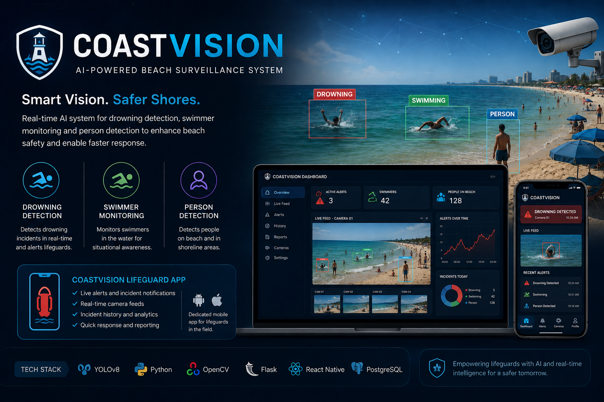
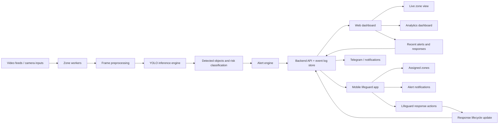
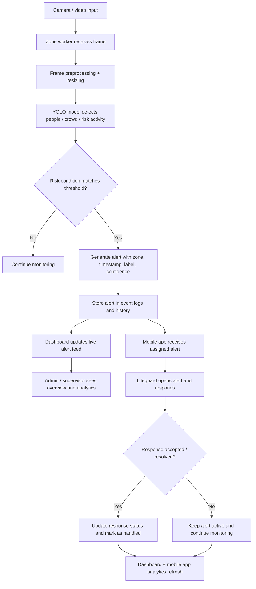

# CoastVision

AI-powered coastal safety and surveillance system for real-time multi-zone monitoring, drowning-risk detection, crowd analysis, and lifeguard response tracking.

This project combines a Python Flask backend, Ultralytics YOLO-based detection, a Vite + React web dashboard, and an Expo mobile app for lifeguards. It is designed for coastal and swimming-pool safety scenarios where fast alerting, clear response tracking, and visual monitoring are critical.




---

## Table of Contents

- [Overview](#overview)
- [Project Goals](#project-goals)
- [System Architecture](#system-architecture)
- [End-to-End Workflow](#end-to-end-workflow)
- [Core Features](#core-features)
- [Project Structure](#project-structure)
- [How It Works](#how-it-works)
- [Quick Start](#quick-start)
- [Environment Variables](#environment-variables)
- [Key API Endpoints](#key-api-endpoints)
- [Documentation](#documentation)
- [Future Enhancements](#future-enhancements)
- [License](#license)

---

## Overview

CoastVision is an end-to-end safety monitoring system built to detect risky situations in water and support quick human intervention. The system monitors zone-based video feeds, processes frames with computer vision models, raises alerts when suspicious activity is detected, and routes those alerts to lifeguards via the dashboard and mobile app.

The solution is not limited to detection alone; it also supports:

- real-time monitoring dashboards,
- crowd analysis,
- lifeguard assignment and zone tracking,
- alert acknowledgements and response status updates,
- analytics for response times and operational activity.

This makes the project useful both as a computer vision system and as an incident-response platform for safety teams.

---

## Project Goals

1. Detect potential drowning or emergency risks in monitored areas.
2. Monitor multiple zones independently and in real time.
3. Provide a clear dashboard for live surveillance and analytics.
4. Provide a mobile command interface for lifeguards.
5. Record alert events and lifeguard responses for review and reporting.
6. Reduce human dependency by making the system assistive rather than fully autonomous.

---

## Demo Video

[](https://youtu.be/mvWzru49PcA)

This demo video shows the core system flow: live monitoring, zone detection, alert generation, and dashboard response workflow.

---

## Screenshots

The project includes several screenshots that show the live monitoring dashboard, analytics view, event logs, and lifeguard operations.

### Dashboard overview


### Analytics overview


### Analytics dashboard


### Event log


### Lifeguard operations


> Screenshot details and naming are documented in [docs/screenshots/README.md](docs/screenshots/README.md).

---

## System Architecture



### Architecture explanation

The system is built as a real-time safety pipeline. Camera feeds enter the backend, where each zone is processed independently. The YOLO model detects objects and risk conditions, and the alert engine decides whether a case should become a recorded event. That event is then pushed to both the dashboard and the mobile app, each serving a different operational purpose: the dashboard is used for live monitoring, analytics, and overview reporting, while the mobile app focuses on assigned lifeguard actions, alert acknowledgment, and response tracking.

---

## End-to-End Workflow



### Workflow explanation

This workflow covers both the dashboard and the mobile app. The backend detects a risky event and pushes the alert to all relevant clients. The dashboard is used for broader monitoring, analytics, and event review, while the mobile app focuses on the lifeguard’s active response workflow. Once a lifeguard responds, the backend updates the alert status, and both interfaces refresh with the new incident status so the whole operation remains synchronized.

---

## Core Features

### Live monitoring
- Multi-zone surveillance layout
- Real-time frame processing
- Detection overlays on frames
- Zone-based views with current status

### AI detection and classification
- YOLO-based object detection for drowning-related activities
- Tracking of people and crowd density
- Risk-aware alerting based on confidence and label category

### Alert system
- Event creation with timestamps and zone data
- Alert log storage for review and reporting
- Classification into drowning, crowd, or emergency-related events

### Lifeguard interaction
- Zone-specific assignment for lifeguards
- Alert acknowledgment and response status updates
- Mobile access for assigned lifeguard actions
- Response timing and resolution tracking

### Dashboard analytics
- Historical alert analytics
- Response summaries by zone or lifeguard
- Crowd activity trends and incident counts
- Zone-wise operational monitoring

### Streaming reliability
- HLS-first live streaming
- Automatic fallback to MJPEG or frame polling
- Stable video serving even under limited network conditions

---

## Project Structure

```text
COASTVISION/
├── backend/
│   ├── server.py                 # Core Flask API and detection engine
│   ├── server_old.py            # Previous backend version
│   └── __init__.py
├── frontend/
│   ├── web/                     # React + Vite admin dashboard
│   ├── mobile/                  # Expo lifeguard mobile app
│   ├── dashboard/               # Legacy dashboard assets
│   └── legacy_te_proj/          # Older prototype / archived UI
├── models/
│   ├── best.pt                  # Trained main model weights
│   └── drowning/
├── dataset/
│   ├── train/                   # Training images and labels
│   ├── valid/                   # Validation set
│   ├── test/                    # Test split
│   └── data.yaml                # Dataset configuration
├── scripts/
│   ├── train_yolov8.py          # Training entry point
│   ├── inference_yolov8.py      # Batch or live inference helper
│   ├── extract_frames.py        # Frame extraction utility
│   └── check_class_distribution.py
├── data/
│   ├── alerts/                  # Alert snapshots and CSV logs
│   ├── raw_videos/              # Camera/video samples
│   ├── frames/                  # Extracted and stored frames
│   ├── logs/                    # Runtime or backend logs
│   └── ...
├── docs/
│   ├── COASTVISION_SYSTEM_DESIGN.md
│   ├── project_plan.md
│   ├── dashboard_integration.md
│   ├── mobile_dev_client_workflow.md
│   ├── screenshots/
│   └── ...
├── runs/
│   └── detect/
├── yolov5/                     # Reference YOLOv5 code and utilities
├── YOLOv8/                     # YOLOv8 reference code and model assets
├── requirements.txt            # Python dependencies
├── README.md
├── run_backend.ps1             # Backend startup script
├── run_frontend.ps1            # Frontend startup script
├── sample.py
├── yolo11n.pt                  # Base YOLO model file
├── yolov8n.pt                  # Base YOLOv8 model file
└── ...
```

This structure reflects the actual system flow: model assets and training data support inference, backend handles alerts and API services, web dashboard provides monitoring and analytics, and the mobile app supports lifeguard response and live operational awareness.

---

## How It Works

### 1. Zone monitoring
The system identifies one or more camera/video zones and creates a monitoring worker for each area. These workers process incoming frames continuously.

### 2. Inference process
Each frame is resized and passed to the YOLO model for object detection. The model identifies relevant classes and confidence values, which are then interpreted by the backend logic.

### 3. Decision-making layer
After detection, the backend checks if the confidence and class match a risky condition. If yes, it creates an alert and stores metadata such as zone, timestamp, label, and confidence.

### 4. Notification and response
The alert is sent to assigned lifeguards and visible in the dashboard. The lifeguard responds by acknowledging, confirming arrival, or marking the incident resolved.

### 5. Analytics and reporting
The system stores response status, timing, and severity information so that users can analyse response performance, audit incidents, and improve operational efficiency.

---

## Quick Start

### 1) Create a virtual environment

```powershell
python -m venv .venv
.\.venv\Scripts\Activate.ps1
```

### 2) Install dependencies

```powershell
pip install -r requirements.txt
```

### 3) Start the backend

```powershell
.\run_backend.ps1
```

### 4) Start the dashboard frontend

```powershell
npm --prefix frontend/web install
npm --prefix frontend/web run dev
```

Or use the project launcher:

```powershell
.\run_frontend.ps1
```

### 5) Open the app

- Dashboard: `http://localhost:5173`
- Backend API: `http://127.0.0.1:8000/api/health`

---

## Environment Variables

The backend uses environment configuration for inference and video processing behavior.

| Variable | Purpose | Example |
|---|---|---|
| `COASTVISION_DEVICE` | Set inference device | `cuda:0` |
| `COASTVISION_REQUIRE_CUDA` | Force CUDA requirement for startup | `1` |
| `COASTVISION_HALF` | Use half precision where supported | `1` |
| `COASTVISION_VIDEO_DIR` | Override source video directory | `C:\path\to\videos` |
| `COASTVISION_IMGSZ` | YOLO input resolution | `640` |
| `COASTVISION_FPS` | Processing FPS cap | `12` |
| `COASTVISION_INFER_EVERY` | Infer every Nth frame | `2` |
| `COASTVISION_MAX_DET` | Maximum detection boxes per frame | `100` |
| `COASTVISION_MAX_SIDE` | Resize guard for large frames | `960` |

---

## Key API Endpoints

### Core system endpoints
- `GET /api/health`
- `GET /api/zones`
- `GET /api/analysis`
- `GET /api/alerts`

### Video endpoints
- `GET /api/zones/<zone_id>/frame.jpg`
- `GET /api/zones/<zone_id>/stream.mjpg`
- `GET /api/zones/<zone_id>/hls/stream.m3u8`
- `GET /api/zones/<zone_id>/detections`

### Lifeguard endpoints
- `GET /api/lifeguards`
- `POST /api/lifeguards/register`
- `POST /api/lifeguards/<lg_id>/assign`
- `GET /api/lifeguards/<lg_id>/alerts`
- `POST /api/lifeguards/<lg_id>/respond`
- `POST /api/lifeguards/<lg_id>/heartbeat`

### Analytics endpoints
- `GET /api/analytics/crowd-status`
- `GET /api/analytics/crowd-alerts`
- `GET /api/analytics/response-times`

---

## Documentation

The repository contains several supporting documents for training, implementation detail, and project planning.

- `docs/COASTVISION_SYSTEM_DESIGN.md` — architecture, flow, system design, and report-ready diagrams
- `docs/project_plan.md` — original implementation plan and milestone overview
- `docs/dashboard_integration.md` — dashboard integration guidance
- `docs/colab_training.md` — training workflow instructions
- `docs/colab_training_full_example.md` — full training pipeline example
- `docs/colab_training_with_auto_backup.md` — backup-aware training notes

---

## Future Enhancements

- Multi-frame temporal analysis to reduce false alarms
- More robust model calibration for different water conditions
- Stronger database-backed alert persistence
- Real RTSP stream support for live camera ingestion
- Background push notifications for mobile devices
- Advanced zone heatmaps and risk score mapping
- Better model accuracy through expanded datasets and retraining

---

## License

This project is intended for academic, research, and practical safety-related use unless otherwise specified.

---

## Summary

CoastVision brings together computer vision, monitoring, analytics, and real-world safety response into a single system. It is designed not only to detect risky events but also to support human decision-making and response coordination through a clear dashboard and mobile interface.

The overall idea is simple:

> Video feeds are monitored in real time, risky events are detected by AI, alerts are routed to lifeguards, and response actions are recorded for analytics and operational improvement.

