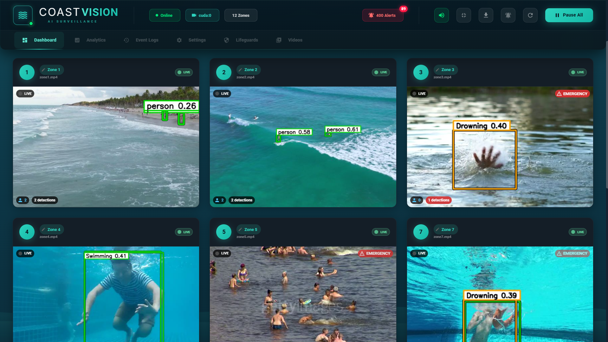
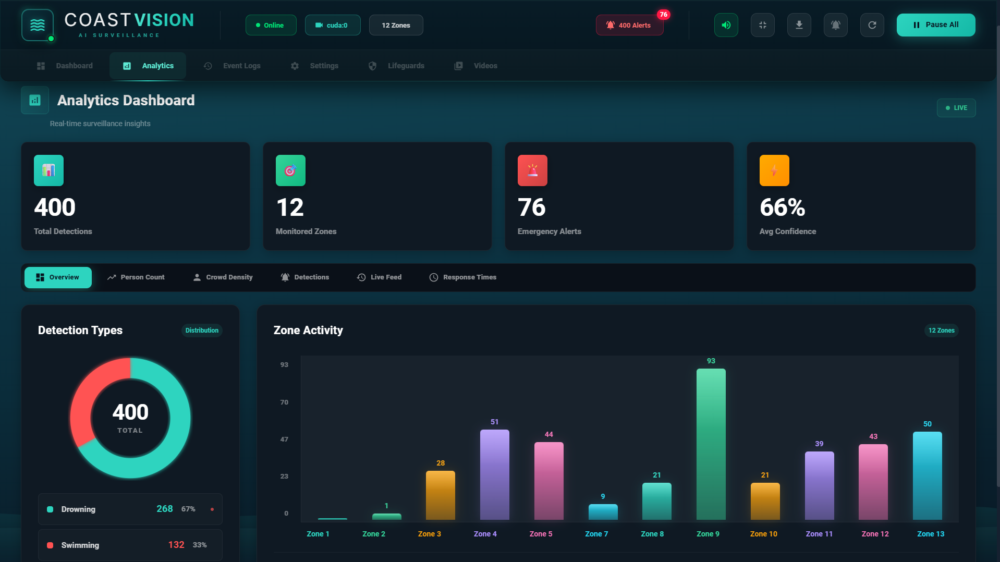
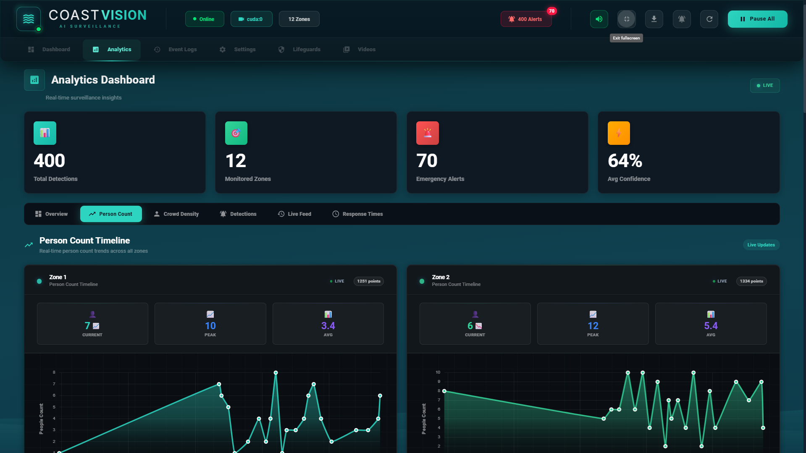
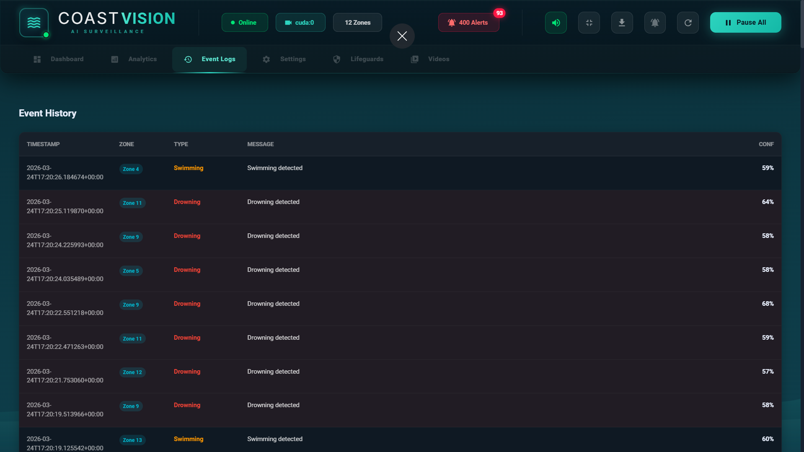
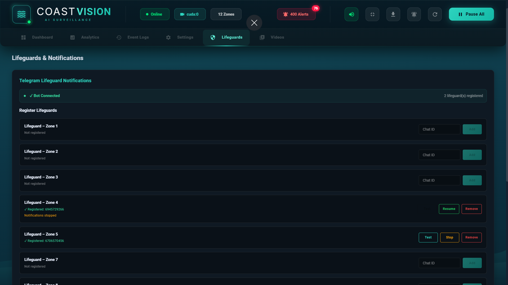

# CoastVision

AI-powered coastal surveillance system for **multi-zone beach monitoring**, **drowning-risk detection**, and **real-time alerting** — built with a **Flask + YOLO** backend and a **React (Vite) dashboard**.


---

## Table of Contents

- [Overview](#overview)
- [Key Capabilities](#key-capabilities)
- [System Architecture](#system-architecture)
- [Screenshots](#screenshots)
- [Project Structure](#project-structure)
- [Quick Start (Windows / PowerShell)](#quick-start-windows--powershell)
- [Configuration (Environment Variables)](#configuration-environment-variables)
- [API Reference (Key Endpoints)](#api-reference-key-endpoints)
- [Model Training & Evaluation](#model-training--evaluation)
- [Documentation](#documentation)
- [Roadmap](#roadmap)
- [License](#license)

---

## Overview

CoastVision is an end-to-end coastal/pool safety monitoring project designed to support lifeguards and safety teams. It ingests zone-wise video feeds, runs **YOLO-based detection**, serves annotated streams, and provides a dashboard for **monitoring, analytics, and alert workflows**.

**Production-Ready Build (March 2026):**
- ✅ **HLS-first streaming** with automatic fallback to MJPEG and single-frame polling
- ✅ Dedicated **Lifeguards** tab in the React dashboard for Telegram operations
- ✅ Telegram controls: **Add / Test / Stop(Pause) / Resume / Remove** per-lifeguard
- ✅ Zone-specific routing enforced by lifeguard ID pattern: `lifeguard_<zoneId>`
- ✅ Telegram registrations + persistent pause state in `data/telegram_users.json`
- ✅ Per-lifeguard error logging and diagnostic reporting
- ✅ Crowd density monitoring with threshold alerts
- ✅ Analytics dashboard with person count timelines and event history
- ✅ Full API suite for monitoring, alerts, and lifeguard operations

---

## Key Capabilities

### Live Monitoring (Multi-Zone)
- Live zone cards (grid view) with detection overlays
- Fullscreen zone monitoring
- Custom zone naming

### Reliable Streaming
- **Primary:** HLS (smooth playback, efficient bandwidth)
- **Fallback chain:** HLS → MJPEG → frame polling (for reliability)

### Alerts + Analytics
- Alert generation + event logs
- Analytics dashboard: charts, timelines, zone activity summaries
- Event History table for recorded detection events

### Lifeguard Operations + Telegram
- Lifeguard registration + zone assignment + alert routing
- Telegram notifications and controls through dashboard UI

---

## System Architecture

```text
Video Files / Feeds
        |
        v
Flask Backend (backend/server.py)
  - Zone manager + worker threads
  - YOLO inference
  - Alert generation + logging
  - HLS/MJPEG/frame APIs
  - Lifeguard + Telegram operations
        |
        v
React Dashboard (frontend/web)
  - Monitoring UI (grid + fullscreen)
  - Analytics (charts + timelines)
  - Event History
  - Lifeguards tab (Telegram controls)
```

---

## Screenshots

Screenshots are stored in `docs/screenshots/`.

### Dashboard (Live Monitoring)


### Analytics




### Event History


### Lifeguards (Operations / Telegram)


> Screenshot naming/caption convention is documented in `docs/screenshots/README.md`.

---

## Project Structure

```text
COASTVISION/
├── backend/                  # Flask backend + detection pipeline
│   ├── server.py             # Main Flask backend
│   ├── server_old.py         # Previous version (backup)
│   └── telegram_notify.py    # Telegram integration helpers
├── frontend/
│   ├── web/                  # Main React dashboard (current UI)
│   ├── dashboard/            # Legacy PyQt dashboard assets
│   └── legacy_te_proj/       # Archived legacy prototype
├── scripts/                  # Train/infer/evaluate helper scripts
├── models/                   # Trained weights location (e.g., models/best.pt)
├── dataset/                  # YOLO dataset splits + dataset/data.yaml
├── data/                     # Runtime logs, snapshots, lifeguard/telegram persistence
├── docs/                     # Guides, plans, integration notes
├── run_backend.ps1           # Backend launcher (foreground/background)
└── run_frontend.ps1          # Frontend launcher
```

---

## Quick Start (Windows / PowerShell)

### 1) Clone the repository
```powershell
git clone https://github.com/Harshal-Bsys27/COASTVISION.git
cd COASTVISION
```

### 2) Create virtual environment
> Note: `run_backend.ps1` expects the environment folder name to be `venv`.

```powershell
python -m venv venv
.\venv\Scripts\Activate.ps1
```

### 3) Install Python dependencies
```powershell
pip install -r requirements.txt
```

### 4) Start backend
```powershell
.\run_backend.ps1
```

Backend endpoints:
- Health: http://127.0.0.1:8000/api/health

### 5) Start frontend (new terminal)
```powershell
.\run_frontend.ps1
```

Frontend:
- http://localhost:5173

---

## Configuration (Environment Variables)

Common backend environment variables:

| Variable | Purpose | Example |
|---------|---------|---------|
| `COASTVISION_DEVICE` | Force inference device | `cuda:0` |
| `COASTVISION_REQUIRE_CUDA` | Fail startup if CUDA unavailable | `1` |
| `COASTVISION_HALF` | FP16 inference (supported GPUs) | `1` |
| `COASTVISION_TF32` | Enable TF32 (Ampere+) | `1` |
| `COASTVISION_CUDNN_BENCHMARK` | cuDNN autotune | `1` |
| `COASTVISION_VIDEO_DIR` | Override video source directory | `C:\path\to\videos` |
| `COASTVISION_MAX_SIDE` | Resize guard | `960` / `1280` |
| `COASTVISION_IMGSZ` | YOLO input resolution | `640` |
| `COASTVISION_FPS` | Processing FPS cap | `12` |
| `COASTVISION_INFER_EVERY` | Infer every Nth frame | `2` |

Frontend API URL (optional):
- Set `VITE_API_URL` if backend is not `http://127.0.0.1:8000`.

---

## API Reference (Key Endpoints)

### Core
- `GET /api/health`
- `GET /api/zones`
- `POST /api/zones/reload`
- `GET /api/analysis`
- `GET /api/alerts`

### Zone Streams and Detection
- `GET /api/zones/<zid>/frame.jpg`
- `GET /api/zones/<zid>/stream.mjpg`
- `GET /api/zones/<zid>/hls/stream.m3u8`
- `GET /api/zones/<zid>/detections`
- `GET /api/zones/<zid>/timeline`
- `GET|POST /api/zones/<zid>/name`

### Video Management
- `GET /api/videos`
- `POST /api/videos/upload`
- `DELETE /api/videos/<filename>`
- `POST /api/videos/<filename>/rename`

### Lifeguard Operations
- `POST /api/lifeguards/register`
- `GET /api/lifeguards`
- `GET /api/lifeguards/<lg_id>`
- `POST /api/lifeguards/<lg_id>/assign`
- `GET /api/lifeguards/<lg_id>/alerts`
- `POST /api/lifeguards/<lg_id>/respond`
- `POST /api/lifeguards/<lg_id>/heartbeat`
- `GET /api/lifeguards/<lg_id>/stream`
- `POST /api/admin/broadcast`

### Telegram Notifications
- `GET /api/telegram/status`
- `POST /api/telegram/register`
- `POST /api/telegram/unregister/<lg_id>`
- `GET /api/telegram/<lg_id>`
- `POST /api/telegram/<lg_id>/test`
- `POST /api/telegram/<lg_id>/pause`
- `POST /api/telegram/<lg_id>/resume`

---

## Model Training & Evaluation

Train:
```powershell
python scripts/train_yolov8.py
```

Evaluate:
```powershell
python scripts/evaluate_model.py --model models/best.pt --data dataset/data.yaml --device 0 --imgsz 640 --save-json
```

Evaluation summary:
- `scripts/evaluation_results.md`

---

## Documentation

Start here:
- `docs/presentation_system_guide.md` (presentation/viva-ready, current behavior)
- `COASTVISION_MASTER_GUIDE.md` (full reference; implementation details)

Other docs:
- `docs/project_plan.md`
- `docs/dashboard_integration.md`
- `docs/colab_training.md`
- `docs/colab_training_full_example.md`
- `docs/colab_training_with_auto_backup.md`
- Screenshot conventions: `docs/screenshots/README.md`

---

## Completed Features

✅ **Multi-zone live monitoring** with detection overlays  
✅ **HLS/MJPEG streaming** with automatic fallback chain  
✅ **Lifeguard registration** with zone assignment  
✅ **Telegram integration** (register, test, pause, resume per-lifeguard)  
✅ **Alert generation** with image snapshots and logs  
✅ **Analytics dashboard** (person count, zone activity, event history)  
✅ **Crowd density monitoring** with configurable thresholds  
✅ **Error diagnostics** and per-lifeguard status reporting  
✅ **Custom zone naming** and persistent settings  
✅ **Comprehensive API suite** for all operations  

## Future Enhancements

- Improve event-level drowning behavior modeling (multi-frame analysis)
- Add richer incident triage and priority scoring
- Production deployment packaging (Docker, Kubernetes)
- Expand test coverage (unit + integration tests)
- Real-time streaming input support (RTSP, HLS, RTMP sources)
- Multi-model inference (pose estimation, anomaly detection)

---

## License

This project is intended for academic and research use unless otherwise specified.

If you want permissive open-source distribution, add an MIT `LICENSE` file at project root.
