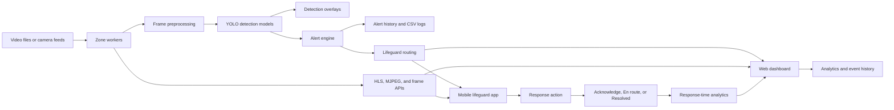
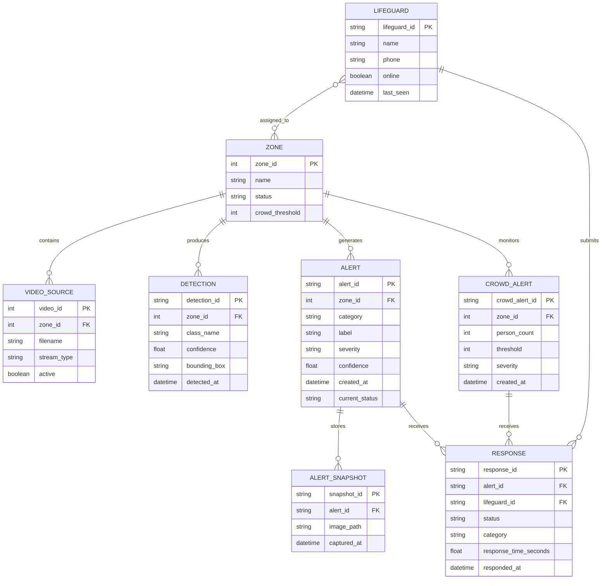
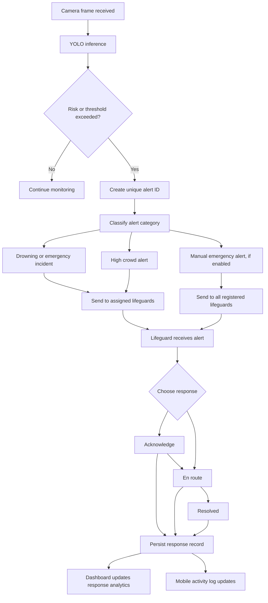
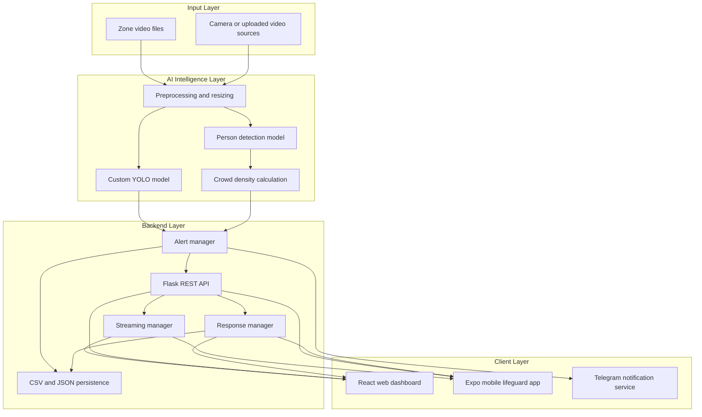
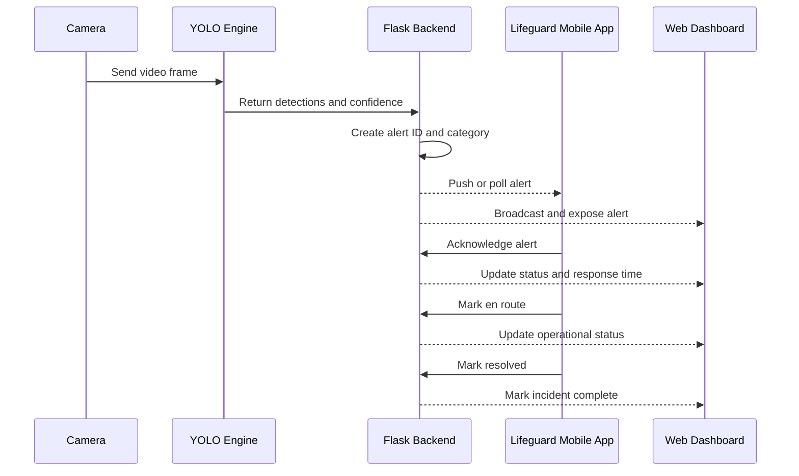

# CoastVision System Design and Proposed Solution

## 1. Project Overview

CoastVision is an AI-assisted coastal surveillance system for monitoring multiple video zones, detecting drowning-related risks, tracking crowd density, and supporting lifeguard response operations. The system uses a Flask backend, Ultralytics YOLO models, a React/Vite web dashboard, and a React Native/Expo mobile application.

The primary operational workflow is:

```text
Video zones -> YOLO inference -> Detection and risk classification
            -> Alert generation -> Lifeguard notification
            -> Acknowledge -> En route -> Resolved
            -> Dashboard analytics and response-time records
```

## 2. Current System Architecture



### Main components

| Component | Responsibility |
|---|---|
| Video zone workers | Read and process video independently for each zone |
| YOLO detection pipeline | Detect Drowning, Person out of water, and Swimming |
| Crowd monitor | Track people per zone and trigger threshold alerts |
| Alert engine | Assign alert IDs, store alerts, and route them to lifeguards |
| Flask backend | Provide REST APIs, streaming APIs, analytics, and lifeguard operations |
| Web dashboard | Show live monitoring, alerts, analytics, events, and lifeguard status |
| Mobile app | Provide assigned-zone monitoring and lifeguard response actions |
| Response tracker | Store lifeguard, status, timestamps, category, and response duration |
| Telegram integration | Provide optional external lifeguard notifications |

### How to explain the architecture

The architecture is divided into four stages. First, the system receives video from multiple monitoring zones. Second, the backend processes the frames with YOLO and calculates detections and crowd status. Third, the alert engine sends important events to the mobile app, dashboard, and optional Telegram service. Finally, lifeguard actions are returned to the backend and displayed as response analytics. This separation allows video processing, alert management, streaming, and user interfaces to evolve independently.

The backend is the central coordination layer. The dashboard and mobile app do not run the AI model themselves; they request data from the backend. This keeps model execution centralized and prevents multiple clients from competing for GPU resources.

## 3. Entity Relationship Diagram

The diagram describes the logical data model. Some current runtime data is stored in memory or CSV/JSON files rather than a relational database; the entities below represent the relationships used by the application.



### ER diagram explanation

The `ZONE` entity represents a monitored coastal or pool area. A zone can have one or more video sources, detections, normal alerts, and crowd alerts. A `DETECTION` is an observation produced by the model, while an `ALERT` is a detection important enough to require attention.

The `LIFEGUARD` entity stores the responder profile and assigned zones. A `RESPONSE` connects a lifeguard to an alert and records the operational status, response category, response duration, and time of action. This relationship is important because one alert may be viewed or handled by more than one lifeguard, especially for emergency events.

An `ALERT_SNAPSHOT` stores the image captured when an alert is created. It gives administrators visual evidence of the event instead of relying only on numeric model output. In the current implementation, these relationships are represented through in-memory objects and CSV/JSON files; the diagram shows the logical model that can later be implemented in a relational database.

## 4. Alert and Lifeguard Response Flow



### Alert-flow explanation

The workflow begins when a video frame is received and passed to the YOLO inference pipeline. If no risky event or crowd threshold violation is found, monitoring continues normally. If a risk is found, the backend creates a stable alert ID and classifies the event, for example as a drowning incident or high crowd alert.

The alert is routed according to its type. Zone-specific incidents are sent to lifeguards assigned to that zone, while emergency events can be broadcast more widely. After receiving the alert, the lifeguard acknowledges it, marks that they are en route, and finally marks it resolved. Each action is persisted and sent to the dashboard so the administrator can see both the current state and the response time.

The important design principle is that detection and confirmation are separate. YOLO identifies a possible risk, but the lifeguard confirms the operational response through explicit status changes.

## 5. Block Diagram for the Report



### Block-diagram explanation

The input layer contains the video material used by the system. The intelligence layer converts raw frames into meaningful detections. The custom YOLO model focuses on the project classes, while the secondary person model supports people counting and crowd analysis.

The backend layer coordinates the entire application. The alert manager decides when a detection becomes an event, the streaming manager serves annotated video, the response manager records lifeguard actions, and CSV/JSON persistence keeps operational records. The client layer contains the web dashboard, mobile lifeguard app, and Telegram integration. This explains why the same backend event can be displayed in several interfaces at the same time.

## 6. Current API and Data Flow

### Monitoring and streaming

- `/api/health` provides backend and GPU status.
- `/api/zones` lists active video zones.
- `/api/zones/<zone_id>/frame.jpg` serves an annotated JPEG frame.
- `/api/zones/<zone_id>/stream.mjpg` serves an MJPEG stream.
- `/api/zones/<zone_id>/hls/stream.m3u8` serves HLS playback when available.
- `/api/zones/<zone_id>/detections` provides current detections.

### How to explain the monitoring APIs

The health endpoint is used to confirm that the backend, model, GPU, and zone workers are available. The zones endpoint tells the clients which monitoring areas exist and whether they are active. The frame, MJPEG, and HLS endpoints provide different streaming options: frame polling is simple and compatible, MJPEG provides a continuous multipart stream, and HLS is more suitable for smoother playback and larger deployments.

### Alert and analytics operations

- `/api/alerts` returns recent detection alerts.
- `/api/analysis` provides alert totals and grouping by zone and label.
- `/api/analytics/crowd-status` provides current crowd status.
- `/api/analytics/crowd-alerts` provides crowd alert history.
- `/api/analytics/response-times` provides response-time metrics, status counts, lifeguard grouping, categories, and recent responses.

### How to explain the alert and analytics APIs

The alert endpoint provides the event list used by monitoring and event-log screens. The analysis endpoint summarizes alerts by zone and label. Crowd endpoints are kept separate because crowd density is a group-level measurement rather than an individual-object detection. The response-time endpoint combines all lifeguard actions and groups them by status, zone, lifeguard, and alert category. This allows an administrator to compare drowning, crowd, and other incident workflows.

### Lifeguard operations

- Lifeguards can be registered, logged in, assigned zones, and marked online.
- Mobile lifeguards can receive alerts through polling and server-sent events.
- Response statuses follow the operational lifecycle:

```text
Alert received -> Acknowledge -> En route -> Resolved
```

### Response-state explanation

`Acknowledge` means the lifeguard has received and seen the alert. `En route` means the lifeguard has accepted responsibility and is moving to the affected zone. `Resolved` means the incident has been handled and can be closed operationally. The first response timestamp can be used to measure alert-to-response latency, while the resolved timestamp can be used later to measure total incident-handling time.

## 7. Proposed Solution

The proposed solution is a reliable, event-driven safety workflow that combines AI detection with human confirmation. The AI model detects potential incidents, but the final operational state is controlled by lifeguards through explicit actions.

### Proposed-solution explanation

The proposed solution improves the current prototype by treating every safety event as a structured lifecycle record. Instead of storing only a message or a final status, the system preserves the alert identity, category, responsible lifeguards, response history, and timestamps. This makes the system auditable and allows a report or administrator to answer three questions: what happened, who responded, and how long did the response take?

### Proposed improvements

1. **Unified alert identity**
   - Every detection, crowd alert, and emergency event receives one stable `alert_id`.
   - The same ID is used by the mobile app, backend, dashboard, and response analytics.

    **Why it matters:** Without a stable ID, a response can be attached to the wrong detection, especially when many alerts occur in the same zone. A unified ID prevents duplicate cards and incorrect status transitions.

2. **Typed alert categories**
   - `drowning_incident`
   - `high_crowd_alert`
   - `emergency_sos`
   - `other_incident`

    **Why it matters:** Category labels keep drowning incidents, crowd warnings, and emergency events from being mixed together. They also make dashboard reports and voice announcements easier to understand.

3. **Reliable response lifecycle**
   - Each alert supports Acknowledge, En route, and Resolved.
   - The mobile UI displays only the next valid actions for the current status.
   - The dashboard shows the current status, lifeguard, category, zone, and response time.

    **Why it matters:** The lifecycle turns an AI warning into an accountable operational process. Administrators can distinguish an alert that was only seen from one where a lifeguard was actively en route or completed the response.

4. **Independent notification channels**
   - Detection announcements can be enabled or disabled separately.
   - Lifeguard response announcements can be enabled or disabled separately.
   - A master sound control can mute all audio when required.

    **Why it matters:** A busy dashboard may receive frequent detection alerts while a lifeguard response is strategically important. Independent controls let the operator silence one type without losing the other.

5. **Dedicated category views**
   - Incident responses
   - High crowd alert responses
   - Emergency response records
   - Per-lifeguard performance
   - Per-zone response performance

    **Why it matters:** Separate views reduce ambiguity. An administrator can inspect only crowd responses, only emergency responses, or only a particular lifeguard without searching through unrelated events.

6. **Persistent event storage**
   - Replace runtime-only queues with a small database or structured event store.
   - Preserve alerts and responses across backend restarts.
   - Store the complete status history rather than only the latest status.

    **Why it matters:** Runtime memory is lost when the backend restarts. Persistent storage ensures that response records remain available for evaluation, reporting, and later investigation.

7. **Performance and reliability controls**
   - Serialize GPU inference across workers.
   - Use FP16 inference when CUDA is stable.
   - Reduce inference size, maximum detections, and inference frequency when VRAM pressure increases.
   - Recover from CUDA out-of-memory errors without stopping video streaming.
   - Use HLS first, then MJPEG, then single-frame polling as fallbacks.

    **Why it matters:** Coastal monitoring may run many zones simultaneously on limited hardware and unstable networks. Controlled inference and streaming fallbacks keep the monitoring interface usable even when the preferred GPU or video method is unavailable.

## 8. Expected Operational Sequence



### Sequence-diagram explanation

The sequence diagram shows the order of communication between the camera, AI engine, backend, lifeguard app, and administrator dashboard. The camera sends frames to the AI engine, the backend converts the result into an alert, and both clients receive the event. The lifeguard then sends response actions back to the backend. The dashboard does not guess the lifeguard state; it receives the persisted state from the backend after each action.

This design supports both real-time delivery and polling. WebSocket or server-sent events can deliver updates immediately, while REST polling provides a reliable fallback when a real-time connection is unavailable.

## 9. Benefits of the Proposed System

- Faster identification of drowning-risk events
- Continuous multi-zone coverage
- Clear responsibility assignment to lifeguards
- Measurable alert-to-response latency
- Separate reporting for drowning, crowd, and emergency categories
- Better auditability through stable alert and response records
- Reduced dependence on a single dashboard or notification channel
- Graceful degradation when GPU, network, or streaming conditions are limited

### Benefits explanation

The system reduces dependence on continuous human observation by providing an automated monitoring layer, but it keeps the lifeguard in control of the final response. Multi-zone processing improves coverage, structured response records improve accountability, and category-specific analytics make system performance easier to evaluate. The streaming fallback chain and GPU safeguards are important because a monitoring system is only useful when it continues operating during resource or network problems.

## 10. Limitations and Future Work

- End-to-end notification latency should be measured experimentally under real network conditions.
- Real-world lifeguard response experiments are required before reporting operational response benchmarks.
- A production database should replace CSV-only response persistence.
- Authentication and role-based authorization should be strengthened for production deployment.
- Mobile push notifications can be added for background delivery.
- Model accuracy should continue to be evaluated on diverse beach conditions, lighting, camera angles, and crowd densities.
